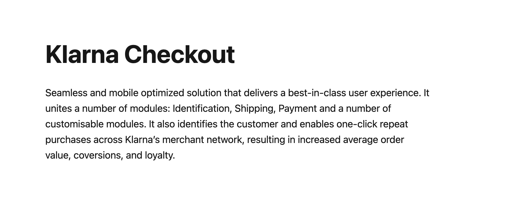

<div align="left">

[](https://klarna.com)

# [Klarna](https://klarna.com)

The checkout API is used to create a checkout with Klarna and update the checkout order during the purchase. As soon as the purchase is completed the order should be read and handled using the [`Order Management API`](https://docs.klarna.com/api/ordermanagement).\n\nRead more on [Klarna checkout](https://docs.klarna.com/klarna-checkout/).

</div>

## Requirements

Building the API client library requires:

1. Java 1.8+
2. Maven (3.8.3+)/Gradle (7.2+)

If you are adding this library to an Android Application or Library:

3. Android 8.0+ (API Level 26+)

## Installation<a id="installation"></a>
<div align="center">
  <a href="https://konfigthis.com/sdk-sign-up?company=Klarna&serviceName=Checkout&language=Java">
    
  </a>
</div>

### Maven users

Add this dependency to your project's POM:

```xml
<dependency>
  <groupId>com.konfigthis</groupId>
  <artifactId>klarna-checkout-java-sdk</artifactId>
  <version>1.0.0</version>
  <scope>compile</scope>
</dependency>
```

### Gradle users

Add this dependency to your `build.gradle`:

```groovy
// build.gradle
repositories {
  mavenCentral()
}

dependencies {
   implementation "com.konfigthis:klarna-checkout-java-sdk:1.0.0"
}
```

### Android users

Make sure your `build.gradle` file as a `minSdk` version of at least 26:
```groovy
// build.gradle
android {
    defaultConfig {
        minSdk 26
    }
}
```

Also make sure your library or application has internet permissions in your `AndroidManifest.xml`:

```xml
<!--AndroidManifest.xml-->
<?xml version="1.0" encoding="utf-8"?>
<manifest xmlns:android="http://schemas.android.com/apk/res/android"
    xmlns:tools="http://schemas.android.com/tools">
    <uses-permission android:name="android.permission.INTERNET"/>
</manifest>
```

### Others

At first generate the JAR by executing:

```shell
mvn clean package
```

Then manually install the following JARs:

* `target/klarna-checkout-java-sdk-1.0.0.jar`
* `target/lib/*.jar`

## Getting Started

Please follow the [installation](#installation) instruction and execute the following Java code:

```java
import com.konfigthis.client.ApiClient;
import com.konfigthis.client.ApiException;
import com.konfigthis.client.ApiResponse;
import com.konfigthis.client.KlarnaCheckout;
import com.konfigthis.client.Configuration;
import com.konfigthis.client.model.*;
import com.konfigthis.client.api.OrderApi;
import java.util.List;
import java.util.Map;
import java.util.UUID;

public class Example {
  public static void main(String[] args) {
    Configuration configuration = new Configuration();
    configuration.host = "https://api.klarna.com";
    KlarnaCheckout client = new KlarnaCheckout(configuration);
    String orderId = "orderId_example";
    try {
      Order result = client
              .order
              .abortOrder(orderId)
              .execute();
      System.out.println(result);
      System.out.println(result.getTags());
      System.out.println(result.getOrderId());
      System.out.println(result.getName());
      System.out.println(result.getPurchaseCountry());
      System.out.println(result.getPurchaseCurrency());
      System.out.println(result.getLocale());
      System.out.println(result.getStatus());
      System.out.println(result.getBillingAddress());
      System.out.println(result.getShippingAddress());
      System.out.println(result.getOrderAmount());
      System.out.println(result.getOrderTaxAmount());
      System.out.println(result.getOrderLines());
      System.out.println(result.getCustomer());
      System.out.println(result.getMerchantUrls());
      System.out.println(result.getHtmlSnippet());
      System.out.println(result.getMerchantReference1());
      System.out.println(result.getMerchantReference2());
      System.out.println(result.getStartedAt());
      System.out.println(result.getCompletedAt());
      System.out.println(result.getLastModifiedAt());
      System.out.println(result.getOptions());
      System.out.println(result.getAttachment());
      System.out.println(result.getExternalPaymentMethods());
      System.out.println(result.getExternalCheckouts());
      System.out.println(result.getShippingCountries());
      System.out.println(result.getShippingOptions());
      System.out.println(result.getMerchantData());
      System.out.println(result.getGui());
      System.out.println(result.getMerchantRequested());
      System.out.println(result.getSelectedShippingOption());
      System.out.println(result.getRecurring());
      System.out.println(result.getRecurringToken());
      System.out.println(result.getRecurringDescription());
      System.out.println(result.getBillingCountries());
      System.out.println(result.getDiscountLines());
    } catch (ApiException e) {
      System.err.println("Exception when calling OrderApi#abortOrder");
      System.err.println("Status code: " + e.getStatusCode());
      System.err.println("Reason: " + e.getResponseBody());
      System.err.println("Response headers: " + e.getResponseHeaders());
      e.printStackTrace();
    }

    // Use .executeWithHttpInfo() to retrieve HTTP Status Code, Headers and Request
    try {
      ApiResponse<Order> response = client
              .order
              .abortOrder(orderId)
              .executeWithHttpInfo();
      System.out.println(response.getResponseBody());
      System.out.println(response.getResponseHeaders());
      System.out.println(response.getStatusCode());
      System.out.println(response.getRoundTripTime());
      System.out.println(response.getRequest());
    } catch (ApiException e) {
      System.err.println("Exception when calling OrderApi#abortOrder");
      System.err.println("Status code: " + e.getStatusCode());
      System.err.println("Reason: " + e.getResponseBody());
      System.err.println("Response headers: " + e.getResponseHeaders());
      e.printStackTrace();
    }
  }
}

```

## Documentation for API Endpoints

All URIs are relative to *https://api.klarna.com*

Class | Method | HTTP request | Description
------------ | ------------- | ------------- | -------------
*OrderApi* | [**abortOrder**](docs/OrderApi.md#abortOrder) | **POST** /checkout/v3/orders/{order_id}/abort | Abort an order
*OrderApi* | [**createNewOrder**](docs/OrderApi.md#createNewOrder) | **POST** /checkout/v3/orders | Create an order
*OrderApi* | [**getOrderDetails**](docs/OrderApi.md#getOrderDetails) | **GET** /checkout/v3/orders/{order_id} | Get order details
*OrderApi* | [**updateOrder**](docs/OrderApi.md#updateOrder) | **POST** /checkout/v3/orders/{order_id} | Update an order


## Documentation for Models

 - [Address](docs/Address.md)
 - [Attachment](docs/Attachment.md)
 - [Checkbox](docs/Checkbox.md)
 - [CheckboxV2](docs/CheckboxV2.md)
 - [Customer](docs/Customer.md)
 - [DeliveryDetailsV1](docs/DeliveryDetailsV1.md)
 - [Dimensions](docs/Dimensions.md)
 - [DiscountLine](docs/DiscountLine.md)
 - [Gui](docs/Gui.md)
 - [MerchantRequested](docs/MerchantRequested.md)
 - [MerchantRequestedCheckbox](docs/MerchantRequestedCheckbox.md)
 - [MerchantUrls](docs/MerchantUrls.md)
 - [Options](docs/Options.md)
 - [Order](docs/Order.md)
 - [OrderLine](docs/OrderLine.md)
 - [PaymentProvider](docs/PaymentProvider.md)
 - [PickupLocationV1](docs/PickupLocationV1.md)
 - [ProductIdentifiers](docs/ProductIdentifiers.md)
 - [ProductV1](docs/ProductV1.md)
 - [SelectedAddon](docs/SelectedAddon.md)
 - [ShippingAttributes](docs/ShippingAttributes.md)
 - [ShippingOption](docs/ShippingOption.md)
 - [Subscription](docs/Subscription.md)
 - [TimeslotV1](docs/TimeslotV1.md)


## Author
This Java package is automatically generated by [Konfig](https://konfigthis.com)
